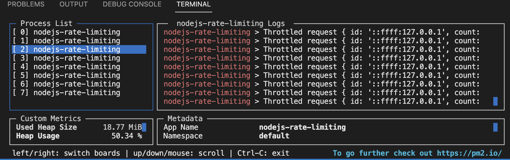

# NodeJS Rate Limiting example

## About the application
The application is comprised of a private (protected by a very simple check on the `Authorization`
header, where it's expected a specific UUID) and a publc endpoint, both of which are rate limited, 
the criteria for identifying a client and counting its number of calls to the API is the 
`Authorization` header and the IP address `req.socket.remoteAddress`, respectively.

Rate limiting is done using a fixed window, which is defined the hour of the day (UTC), call counts 
are stored using Redis and are resetted every hour (in layman's terms, every time the minute pointer
hits 12). To check if the call can go through, a request is made to, in the same transaction and in 
this order, query the amount of requests in the current time window, increment by one and set correct TTL 
(end of current time window). If the value is greater than the defined limit, the request is rejected,
otherwise it's allowed. Redis was chosen because it's a very fast in-memory database for our needed quick
read and writes to specific keys, it scales horizontally fairly well and provide useful abstractions such 
as TTL.

This approach has limitations such as allowing twice the defined number of calls in a given hour, e.g. when
the requester dumps a "full tank" of requests at the last minute of a given hour, and then proceeds to
do the same at the first minute of the next hour. I've considered it good enough as the real enforced limit is still within the same order of magnitude, and the solution is very straightforward.

This solution is based on my own [NestJS template](https://github.com/lfujiwara/nestjs-template).
I've stripped the NestJS dependencies in favor of an Express application to keep it simpler, but the 
solution can be ported back to NestJS with ease, transforming middlewares into app guards, Express routers into NestJS controllers, etc.

## Requirements (may work with older versions, but these are the ones I've used)
  - NodeJS 18.12.1
  - Docker 20.10.17
  - Docker Compose 2.10.2

## Setting up project
  1. Install dependencies with `npm ci`
  2. Start redis with `docker compose up -d redis`
  3. Start project with `npm run start:dev`, `docker compose up -d app` or `pm2 start` 
  (make sure to `npm i -g pm2` and `npm run build` first)
    - When using PM2, it'll spawn a process for each CPU core, and load balance it.
    Here's an example using a MacBook Air (M1, 2020)
    

## Utils
- Reset rate limiter: `npm run reset-rate-limiter`

## Using the HTTP API
  - Example HTTP calls are provided in the `endpoints` folder.

## Load testing
Use siege, a script is provided in the `load-test.sh` file.

